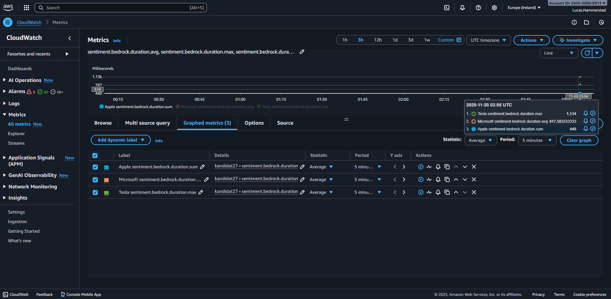
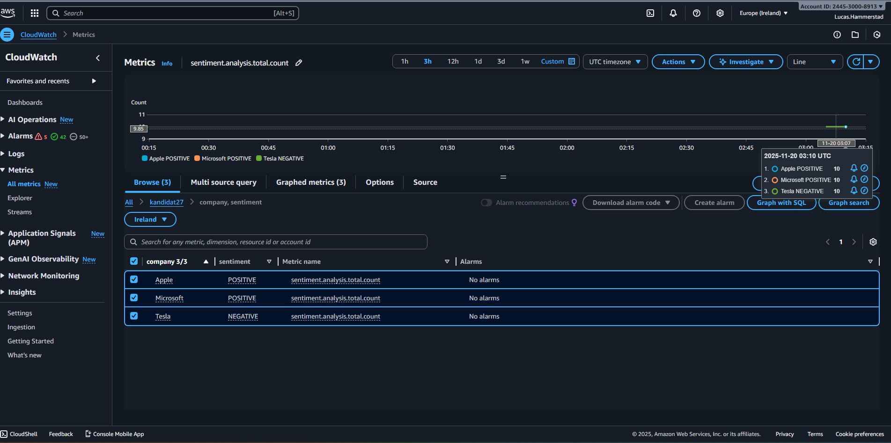
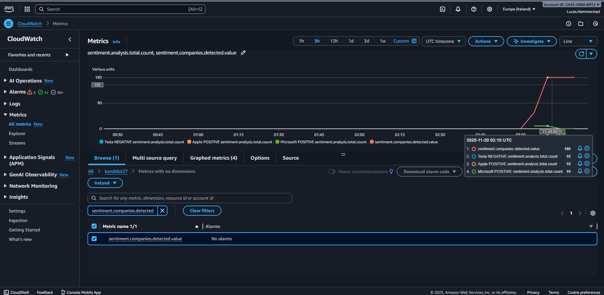
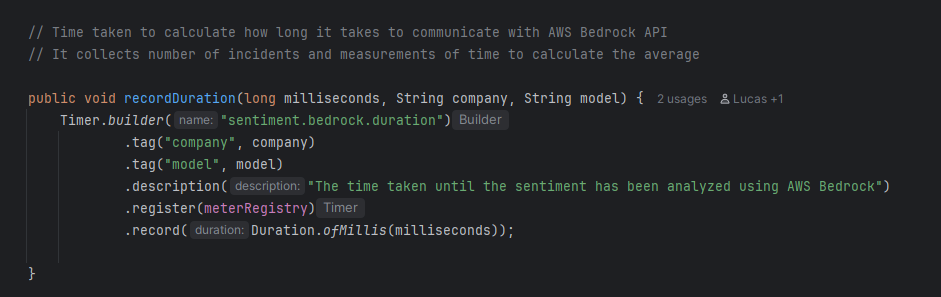
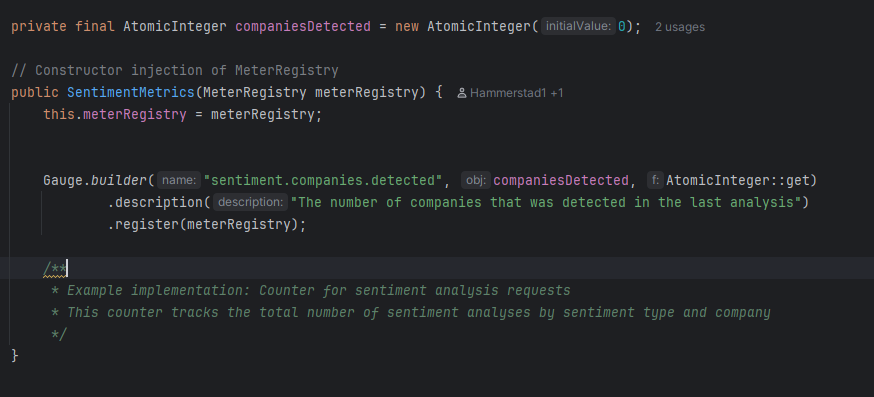
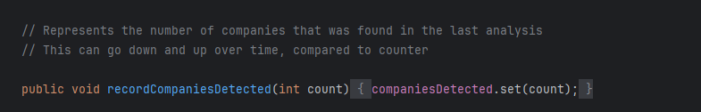
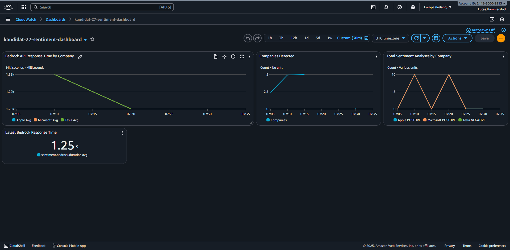
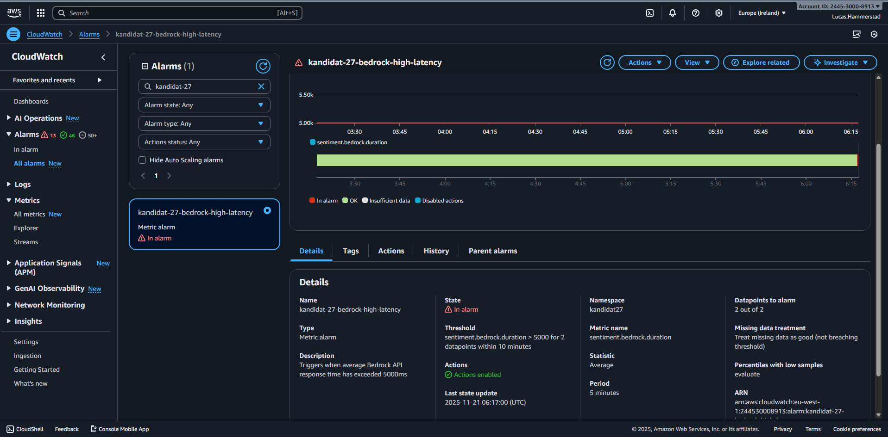
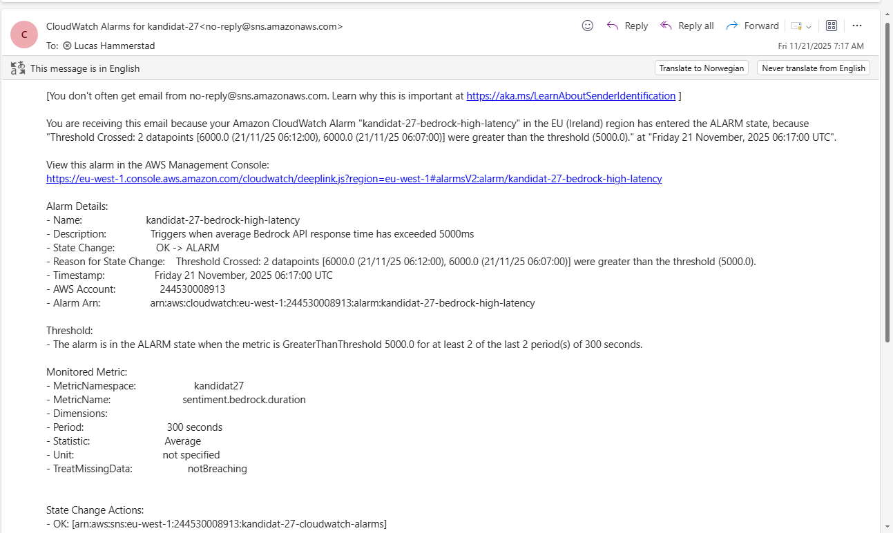

# README_SVAR - DevOps Eksamen, Kandidat 27

# Oppgave 1, Terraform, S3 og infrastruktur

## Leveranser

 - Terraform koden min ble skrevet i mappen: **`infra-s3/`**
 - Workflow for terraform: **`.github/workflows/terraform-s3.yml`**
 - Opprettet S3-bucket: **`kandidat-27-data` (region: `eu-west-1`)**
 - Lifecycle-regel opprettet for prefix **`midlertidig`**
 - Public Access Block aktivert (alle 4 er satt til true)

### Validerer AWS credentials og eksporterer de
- AWS_ACCESS_KEY_ID
- AWS_SECRET_ACCESS_KEY
- AWS_REGION (bruker eu-west-1 her)

### Initialiserer Terraform
`Terraform init` blir kjørt for å gjøre følgende steg:

- Laste ned AWS-provider
- Koble til backend (`pgr301-terraform-state`)

### Apply terraform
- `terraform fmt`: rydder koden
- `terraform validate`: sjekker om koden stemmer
- `terraform plan`: viser hva terraform gjør
- `terraform apply`: kjører de faktiske endringene opp mot s3 bucket

Min s3 bucket: **`kandidat-27-data`** (region: `eu-west-1`)

### Lifecycle

- **Prefix:** `midlertidig/`
- **Transition:** Flyttes til Glacier etter 30 dager
- **Expiration:** Blir slettet etter 90 dager
- **Rule ID:** `temporary-files-lifecycle`

### Public access Block:
Alle satt til **Enabled**:
- BlockPublicAcls
- IgnorePublicAcls
- BlockPublicPolicy
- RestrictPublicBuckets

# Oppgave 2 - AWS Lambda, SAM og GitHub Actions

### Del A - Deploy og test SAM-applikasjon

Hentet riktig python versjon med docker (manglet Python 3.11 lokalt), og deretter bydge den med: `sam build --use-container`

 - Kjørte lambda-funksjonen: `sam local invoke SentimentAnalysisFunction -e .\sample_event.json`
 - Funksjonen returnerte forventet JSON output, som viste at tden ble lagret i S3 bucket: `s3_location`
 - Deployet applikasjonen med: `sam deploy --guided`

### Verifisering at applikasjon skrev til s3

Jeg fikk problemer ved å teste API-et med: `curl -X POST https://YOUR-API-URL/analyze \H "Content-Type: application/json"
-d '{"text": "Apple launches groundbreaking new AI features while Microsoft faces security concerns in their cloud platform."}'`

Så jeg brukte heller isteden: 
 - `$uri = "https://mp9i0wzr7i.execute-api.eu-west-1.amazonaws.com/Prod/analyze/"`
 - `$body = @{ text = "Dette er en testmelding fra PowerShell via Invoke-RestMethod" } | ConvertTo-Json`
 - `$headers = @{ "Content-Type" = "application/json" }`
 - `$response = Invoke-RestMethod -Method Post -Uri $uri -Headers $headers -Body $body`
 - `$response | ConvertTo-Json -Depth 5`

### Leveranser

 - **API Gateway URL:**
   `https://mp9i0wzr7i.execute-api.eu-west-1.amazonaws.com/Prod/analyze/ `
 - **S3 objekt:**
    `"s3://kandidat-27-data/midlertidig/comprehend-20251118-085214-6c32287c.json"`

### Del B - Fiks Github Actions workflow

### Leveranser
 - workflow-fil: https://github.com/Hammerstad1/devops-exam-27/blob/main/.github/workflows/sam-deploy.yml
 - Successful deploy: https://github.com/Hammerstad1/devops-exam-27/actions/runs/19489519691/job/55778870846
 - PR validation: https://github.com/Hammerstad1/devops-exam-27/actions/runs/19487543875/job/55772856889

### Instruksjoner til sensor:

1. **Fork repositoriet**
2. **Legg til GitHub secrets**
3. **Endre bucket navn:** Endre bucket navn i sam-comprehend/template.yaml til din egen
4. **Test workflowen:** Opprett en pull request til main, her tar workflow å kjører automatisk `sam validate` og `sam build`.
Deretter merge til main, hvor workflowen blir deployet automatisk til AWS via `sam deploy`

   
# Oppgave 3 - Container og Docker

### Del A - Containeriser Spring Boot-applikasjonen

Jeg har laget en Dockerfil i `sentiment-docker/Docker` Som bruker multi-stage build:
Stage 1 (build): bygger med Maven + Anazib Coretto 21
Stage 2 (runtime): Kjører Amazon Corretto 21 Alpine for minimal image-størrelse

Applikasjonen bygges ved Spring Boot JAR-en og blir kjørt med: `ENTRYPOINT ["java", "-jar", "app.jar"]`

Containeren eksponeres på port 8080

Jeg bygde og kjørte imaget lokalt med kommandoen: 
`docker build -t sentiment-docker .
docker run -e AWS_ACCESS_KEY_ID=$AWS_ACCESS_KEY_ID \
  -e AWS_SECRET_ACCESS_KEY=$AWS_SECRET_ACCESS_KEY \
  -e S3_BUCKET_NAME=<din bucket> \
  -p 8080:8080 sentiment-docker`

Deretter testet jeg API-et med:
`curl -X POST http://localhost:8080/api/analyze \
  -H "Content-Type: application/json" \
  -d '{"requestId": "test-123", "text": "NVIDIA soars while Intel struggles with declining sales"}'`

### Leveranser

Docker fil: `sentiment-docker/Dockerfile`

### Del B - Github Actions workflow for Docker Hub

### Leveranser

Workflow-fil: `https://github.com/Hammerstad1/devops-exam-27/blob/main/.github/workflows/docker-build.yml`
Successful build: `https://github.com/Hammerstad1/devops-exam-27/actions/runs/19494820526/job/55794373162`

**Tagging-strategi:** 
1. Jeg valgte å sette `latest` som alltid peker på den nyeste versjonen av docker imaget. Dette gjør det lettere å alltid hente sin siste versjon.
2. Jeg har brukt teknikken med `sha-<git-commit>` hvor hver versjon får en unik tag basert på git commit SHA. 
Dette gjør det svært enklere å finne sitt image senere for debugging eller rollback

**Container Image navn**: 
 - DockerHub repository: `https://hub.docker.com/repository/docker/hammerstad783/sentiment-docker/general`
 - latest: `hammerstad783/sentiment-docker:latest`
 - Tagged: `hammerstad783/sentiment-docker:sha-97c9a58`

**Beskrivelse for sensor:**
1. Fork repositoriet til din egen GitHub konto
2. Lag docker tokens hos hub.docker.com -> account -> settings -> Personal access tokens -> Generate new token
3. Opprett github secrets for docker: DockerHub brukernavn: `DOCKER_USERNAME`, DockerHub passord: `DOCKER_TOKEN` 
4. Hvis ønskelig, oppdater image-navnet i fila `.github/workflows/docker-build-yml`
5. Deretter push en endring til sentiment-docker, som vil da trigge workflow filen. 
Workflow vil da begynne å bygge og publisere til din egen DockerHub konto

# Oppgave 4 - Observabilitet, Metrikksamling og Overvåkningsinfrastruktur

## Del A - Implementasjon av Custom Metrics

## Leveranser

### Screenshot

Timer:

Counter:

Gauge:

### Teknisk forklaring: 

### Timer: `sentiment.bedrock.duration`
jeg valgte bruk av timer, fordi den gir forskjellige nyttige informasjon for måling av latency og responstid for ekstre API-kall.
Informasjon den samler inn er innenfor: `Count: antall API kall`, `Sum: totale tiden brukt`, 
`Max: Lengste responstid`, `Average: Gjennomsnittlig respontid brukt` og `Persentiler: Som identifiserer ekstrem verdier`

**Implementasjon**:

### Gauge: `sentiment.companies.detected`
Gauge hjelper med å identifisere antall selskaper med current value i siste analyse. Gauge er perfekt for verdier som 
kan gå opp og ned over en periode, i motsetning til Counter som bare er for økning, hjelper gauge å holde følge med på 
verdier i sitt nåværende tilstand.

**Implementasjon**: 

### Del B - Infrastruktur for Visualisering og Alarmering

### Leveranser

Terraform-kode: Du finner min terraform kode i `infra-cloudwatch` mappen

Dashboard Screenshot:

Alarm Screenshot:

E-post Screenshot:

varslingsystemet i epost:

# Oppgave 5 - KI-assistert Systemutvikling og DevOps-prinsipper

### Innledning
Kunstig intelligens (KI) har gått fra å være noe som er eksperimentelt til å være noe som er integrert i hverdagen til utviklere. 
Verktøyene GitHub Copilot, ChatGPT og Claude har evnen til å generere kode, foreslå løsninger, skrive tester og hjelpe med 
infrastruktur og DevOps-lignende oppgaver. Denne utviklingen i KI har ført til en drastisk endring i hvordan vi programmerer, organiserer
og gjennomfører DevOps-praksiser. I denne oppgaven skal jeg gå igjennom hvordan KI-assistenter påvirker de tre sentrale 
DevOps-prinsippene: Flow, Feedback og kontinuerlig læring og forbedring. Denne drøftingen kommer til å bli bygd på generell teori
og mine erfaringer fra eksamensoppgaven. 

### Flow
KI-verktøy kan ha en betydelig positiv effekt når det kommer til utviklingsflyt, hvor den mest åpenbare er 
økt hastighet for utviklere. Her kan KI gi forslag til kode, generere boilerplate-kode, få hjelp med syntax og lage tester
og dokumentasjon. Dette reduserer drastisk tiden utviklere trenger å bruke tiden sin på repeterende oppgaver og oppgaver med lav verdi.

Men samtidig kan KI introdusere nye problemer som man ikke hadde før. Generert kode kan være feilaktig, ineffektiv eller bryte med
kodemønstrene. Her flyttes arbeidet fra å skrive kode til å kvalitetssikre KI-koden. Hvis utviklerteamet blir alt for avhengig av 
KI-verktøy, kan man møte problemet at man skriver kode som man ikke fullt forstår, som vil introdusere nye problemer i senere faser. 

I DevOps-praksis skal det alltid være jevn flyt og stabilitet. Kode som er skrevet av KI kan styrke eller svekke dette.
Hvis teamet holder gode standarder som automatisk testing og klare retningslinjer, kan KI bidra til raskere pull requests og kortere lead time.
Hvis ikke, kan man risikere noe som "fake velocity", hvor man har høy produksjon av kode, men som må brukes masse tid på å omskrives i etterkant. 
KI-generert kode påvirker også code review-prosessen direkte. Her må reviewere ofte være enda mer kritiske til kode som har blitt KI generert, noe som
kan gjøre review-prosessen enda tyngre. KI-verktøyene er dermed ikke en garanti forbedring av flyt; effekten avhenger av hvor godt utviklingsprosessen er organisert. 

### Feedback
Feedback er en av de grunnpilarene i DevOps, og her endrer KI hvordan et team bør jobbe med tilbakemeldingsflyten. Når kode har blitt generert av KI,
blir det enda viktigere for team å ha gode mekanismer for å validere kodekvalitet tidlig og kontinuerlig. Hvor dette gjelder særlig områder som automatisert testing, statisk analyse,
sikkerhetsskanning, monitorering og metrikker.

Dette kom også tydelig frem under eksamen, der jeg måtte bruke CloudWatch-metrikkene for å verifisere at systemet oppførte seg som forventet.
Dette viser hvor viktig det er med raske og presise feedback-sløyfer er når man jobber med KI-relatert funksjonalitet

En utfordring som tydelig kommer frem med KI-verktøy, er at de ofte kan fremstå som veldig overbevisende, men er ikke nødvendigvis korrekt. 
Koden som KI produserer kan være syntaktisk riktig, men selve innholdet kan ha logiske feil og ineffektive mønstre. Dette øker behovet for raske feedback-sløyfer
som fanger opp disse avvikene før de når produksjon. Her spiller automatiserte tester, integrasjonstester og ytelsesmålinger en sentral rolle.
DevOps-team som allerede har integrert sterke pipelines vil lettere kunne integrere KI-verktøy uten at det reduserer kvaliteten. 

På den positive siden kan KI også styrke feedback-loops, hvor KI-verktøy kan foreslå endringer og generere kode automatisk. 
Dette kan gjøre feedbacken raskere og mer tilgjengelig, spesielt for utviklere med mindre erfaring. 

### Kontinuerlig læring og forbedring
Et av KI-ens sterkeste egenskaper er evnen til å søke etter hvilken som helst informasjon og deretter kunne bli stilt konkrete spørsmål om temaet.
Dette har en stor påvirkning på læringskulturen og kompetanseutvikling. På en side så bidrar KI til å gjøre kunnskap enda mer tilgjengelig,
hvor man kan raskt lære nye rammeverk, få forklaring på ukjent kode og få eksempler. Dette kan styrke læringen til utviklere 
som er nysgjerrige. 

På det negative aspektet kan overavhengighet av KI svekke sin dybdeforståelse. Hvis utviklere alltid får ferdig løsninger
uten forståelse på koden, kan de i senere tid miste evnen til å kunne feilsøke komplekse problemer. I DevOps, hvor forståelse 
for systemer er kritisk, kan dette være et problem. Derfor må organisasjoner legge til rette for 
kunnskapsdeling ved parprogrammering og gjennomgang av KI-forslag. Slik læringen skjer i teamet, og ikke bare i individet. 

KI-verktøyene introduserer nye ferdigheter som utviklere må lære. Utvikleren må kunne evaluere KI-forslagene på en 
kritisk måte og klare å formulere gode prompter. Hvor dette er en ny kompetanse som stadig blir viktigere. 

### Konklusjon

KI-assistenter har en stor påvirkning på DevOps-prinsippene. KI-assistenter kan forbedre flyt gjennom økt effektivitet, 
men kan også introdusere problemer hvis kvaliteten på generert kode er ustabil. Feedback blir stadig viktigere, 
spesielt innenfor testautomatisering og observabilitet. Når det gjelder kontinuerlig læring, så er muligheten med KI enormt, 
men kan også introdusere nye problemer hvis man bruker verktøyet ukritisk. 
  